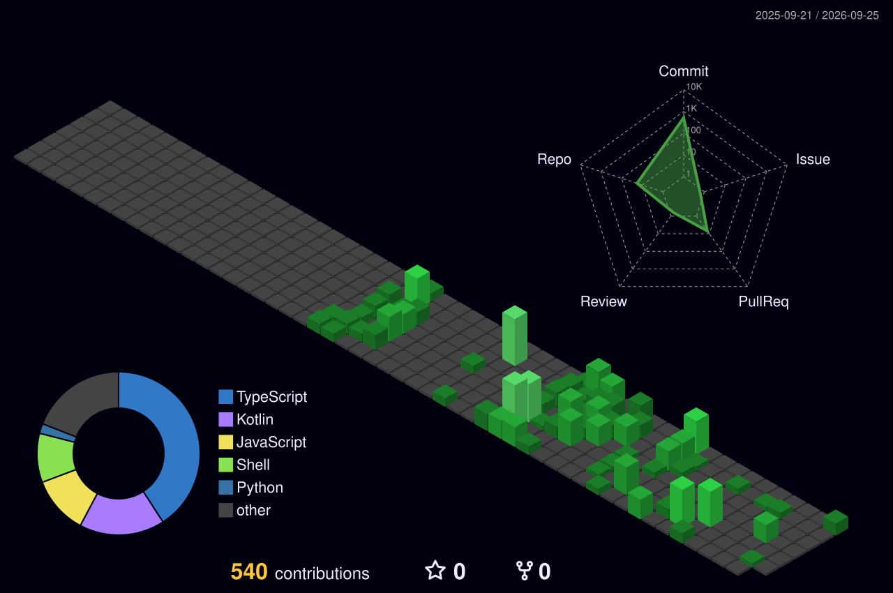

<div align="center">



<br />

<a href="https://github.com/HubbaBubbaPrepod"></a><a href="https://t.me/BubbleGumFriend"></a><a href="https://hubbabubbaprepod.github.io/"></a><a href="mailto:heyhubbabubbapr@gmail.com"></a>

</div>


## `> whoami`

```yaml
name: zxchubbubba
role: Full-stack developer
focus: [web platforms, mobile apps, automation, infrastructure]
currently_building: useful things that survive outside localhost
location: Russia
status: open to ambitious projects and collaboration
```

I build complete products — from the interface people touch to the services, databases,
deployment and automation behind it. I like fast software, clean architecture and systems
that are easy to understand at 3 AM.

> A large part of my current work lives in private repositories: web platforms,
> Android applications, developer tools, automation and self-hosted infrastructure.




## `> build_matrix`

<table>
  <tr>
    <td width="25%" align="center" valign="top">
      <h3>01 / WEB</h3>
      <code>React · Vite · Next</code><br /><br />
      Interfaces, realtime products and full-stack platforms.
    </td>
    <td width="25%" align="center" valign="top">
      <h3>02 / MOBILE</h3>
      <code>Kotlin · Compose</code><br /><br />
      Native Android apps, device APIs and mobile systems.
    </td>
    <td width="25%" align="center" valign="top">
      <h3>03 / INTELLIGENCE</h3>
      <code>Python · LLM · OSINT</code><br /><br />
      AI tooling, bots, data pipelines and automation.
    </td>
    <td width="25%" align="center" valign="top">
      <h3>04 / INFRA</h3>
      <code>Docker · Linux · SQL</code><br /><br />
      Self-hosted services, deployment and observability.
    </td>
  </tr>
</table>




## `> featured_projects`

<div align="center">

<a href="https://github.com/HubbaBubbaPrepod/Install-Matrix"></a>

<br />

<a href="https://github.com/HubbaBubbaPrepod/SYS.CTL"></a>

</div>


## `> core_loadout`

<div align="center">

### Languages

[](https://skillicons.dev)

### Product & backend

[](https://skillicons.dev)

### Infrastructure & data

[](https://skillicons.dev)

</div>


## `> full_arsenal --expand`

<sub>Every technology from the original profile plus tools verified across local builds and private repositories. Click a category to expand it.</sub>

<details>
<summary><b>01 · LANGUAGES &amp; FOUNDATIONS</b> — 15 technologies</summary>

<br />


</details>

<details>
<summary><b>02 · PRODUCT, WEB &amp; MOBILE</b> — 22 technologies</summary>

<br />


</details>

<details>
<summary><b>03 · BACKEND, DATA &amp; DELIVERY</b> — 22 technologies</summary>

<br />


</details>

<details>
<summary><b>04 · NETWORKING &amp; SELF-HOSTING</b> — 6 technologies</summary>

<br />


</details>

<details>
<summary><b>05 · CREATIVE TOOLKIT</b> — 9 technologies</summary>

<br />


</details>

<details>
<summary><b>06 · ENGINEERING TOOLCHAIN</b> — 10 technologies</summary>

<br />


</details>

<details>
<summary><b>07 · VERIFIED ACROSS LOCAL BUILDS AND PRIVATE REPOSITORIES</b> — 33 more technologies</summary>

<br />


</details>


## `> telemetry`

<div align="center">


<br />


<br />



</div>


## `> contribution_stream`

<div align="center">

<picture>
  <source media="(prefers-color-scheme: dark)" srcset="https://raw.githubusercontent.com/HubbaBubbaPrepod/HubbaBubbaPrepod/output/github-contribution-grid-snake-dark.svg" />
  <source media="(prefers-color-scheme: light)" srcset="https://raw.githubusercontent.com/HubbaBubbaPrepod/HubbaBubbaPrepod/output/github-contribution-grid-snake.svg" />
  
</picture>

<br />

<a href="mailto:heyhubbabubbapr@gmail.com"></a>

</div>
