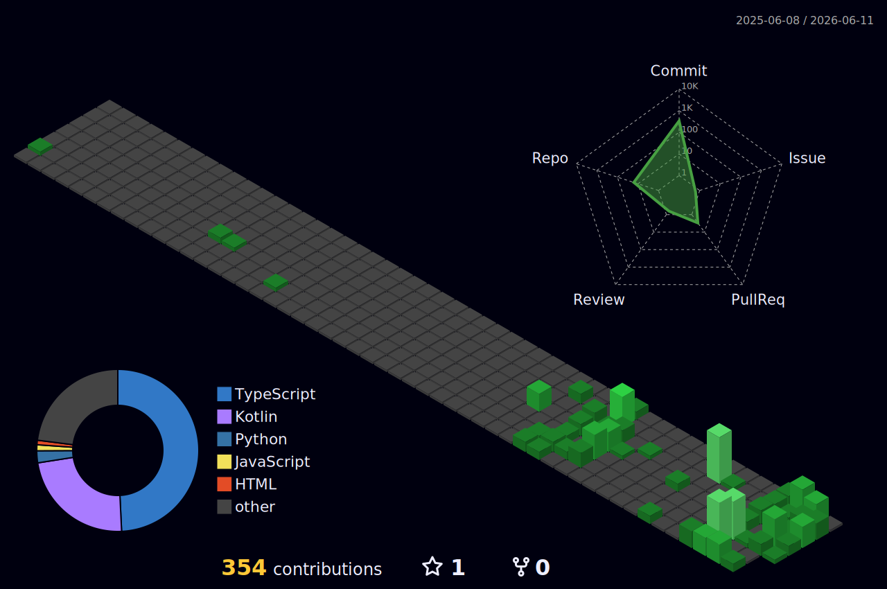

<!-- ==================== 1. ВАУ-ЭФФЕКТ: ЖИВОЙ ТЕРМИНАЛ ==================== -->
<!-- Сгенерированный GIF в стиле ретро-терминала с эффектом загрузки ПК и выводом вашей GitHub-статистики в стиле neofetch -->
<!-- Инструкция: 1. Установить Python и библиотеку github-readme-terminal -->
<!-- 2. Выполнить команду: github-readme-terminal --username HubbaBubbaPrepod -->
<!-- 3. Загрузить полученный GIF в репозиторий (например, в папку assets/) -->
<!-- 4. Вставить путь к GIF ниже -->

  

<!-- ==================== 2. CSS-МАГИЯ: ГРАДИЕНТНЫЙ ЗАГОЛОВОК ЧЕРЕЗ SVG ==================== -->
<!-- Созданный вручную SVG-файл, использующий тег <foreignObject> для вставки HTML/CSS с градиентным текстом, кастомным шрифтом и анимацией -->
<!-- Инструкция: 1. Создать файл header.svg в корне репозитория (см. раздел ниже) -->
<!-- 2. Вставить в него HTML-код с градиентом и стилями -->
<!-- 3. Сослаться на него здесь как на картинку -->

  

<!-- ==================== 3. СТАТИСТИКА: ПИКСЕЛЬНЫЙ ПРОФИЛЬ ==================== -->
<!-- Динамическая SVG-карточка, генерирующая вашу GitHub-статистику в ретро-пиксельном стиле -->

  <picture>
    <source media="(prefers-color-scheme: dark)" srcset="https://pixel-profile.vercel.app/api/github-stats?username=HubbaBubbaPrepod&screen_effect=true&dithering=true&include_all_commits=true&pixelate_avatar=true&theme=journey&color=%23ffffffFF">
    
  </picture>

<!-- ==================== 4. ДОСТИЖЕНИЯ: ТРОФЕИ ==================== -->
<!-- Автоматически обновляемая витрина достижений (звезды, форки, коммиты) в виде трофеев -->

  

<!-- ==================== 5. ПРОГРЕСС-БАРЫ НАВЫКОВ ==================== -->
<!-- Автоматически генерируемые прогресс-бары для ваших навыков, обновляемые через GitHub Actions -->
<!-- Инструкция: Настроить экшен skill-progress (см. раздел ниже), который будет обновлять эту секцию -->
<!-- SKILLS_PROGRESS_START -->
[████████████████████░░░░] Python (80%)
[██████████████████░░░░░░] JavaScript (75%)
[████████████████████░░░░] Rust (70%)
[██████████████░░░░░░░░░░] C++ (60%)
[███████████████████░░░░░] TypeScript (65%)
<!-- SKILLS_PROGRESS_END -->

<!-- ==================== 6. СОЦИАЛЬНЫЕ ИКОНКИ ==================== -->
<!-- Интерактивные ссылки на ваши профили с красивыми иконками и hover-эффектами -->

  <!-- YouTube -->
  
  <!-- Steam -->
  
  <!-- Discord -->
  
  <!-- VK -->
  
  <!-- Telegram -->
  
  <!-- Twitch -->
  

<!-- ==================== 7. ЯНДЕКС.МУЗЫКА: ТЕКУЩИЙ ТРЕК ==================== -->
<!-- Виджет, отображающий обложку и название трека, который вы слушаете прямо сейчас в Яндекс.Музыке -->
<!-- Инструкция: 1. Развернуть виджет yandex-music-widget на Vercel/Render (см. раздел ниже) -->
<!-- 2. Получить токен Яндекс.Музыки и настроить -->
<!-- 3. Вставить ссылку на ваш инстанс виджета ниже -->

  

<!-- ==================== 8. "ЖИВОЙ" СПИСОК ЦЕЛЕЙ ==================== -->
<!-- Секция, автоматически обновляющая прогресс выполнения ваших целей через GitHub Actions -->
<!-- Инструкция: Настроить экшен update-goals (см. раздел ниже) -->
<!-- GOALS_START -->
### 🎯 Мои цели на 2026
- [x] Изучить Rust на продвинутом уровне ✅
- [x] Внести вклад в 5 Open Source проектов ✅
- [ ] Написать 10 технических статей (6/10)
- [ ] Пройти курс по машинному обучению (30%)
- [ ] Создать свой первый компилятор (0%)
<!-- GOALS_END -->

<!-- ==================== 9. ПАСХАЛКИ ==================== -->
<!-- Скрытый текст, видимый только при выделении мышью -->
Ты думал, здесь ничего нет? А вот и нет! Настоящий хакер всегда выделяет текст. Добро пожаловать в избранный круг! 👾

<!-- ==================== 10. АНИМИРОВАННЫЕ GIF-КАРТИНКИ ==================== -->
<!-- Декоративные анимации для оживления профиля -->

  
  

<!-- ==================== 11. ТЕХНОЛОГИЧЕСКИЙ СТЕК ==================== -->
# 💻 Tech Stack:
                                                                             

<!-- ==================== 12. СТАНДАРТНАЯ СТАТИСТИКА GITHUB ==================== -->
# 📊 GitHub Stats:
 
 

---

---

---

---

---
<picture>
  <source media="(prefers-color-scheme: dark)" srcset="https://pixel-profile.vercel.app/api/github-stats?username=HubbaBubbaPrepod&screen_effect=true&dithering=true&include_all_commits=true&pixelate_avatar=true&theme=journey&theme=journey&color=%23ffffffFF&hide=avatar%2Ccommits%2Cissues%2Ccontributions%2Cprs%2Crank%2Cstars">
  
</picture>
